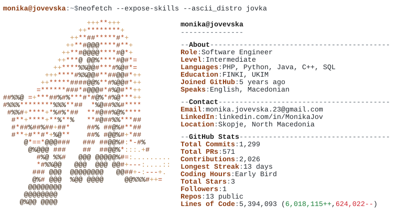

<picture>
  <source media="(max-width: 600px) and (prefers-color-scheme: dark)" srcset="assets/neofetch-mobile-dark.svg"/>
  <source media="(max-width: 600px)" srcset="assets/neofetch-mobile-light.svg"/>
  <source media="(prefers-color-scheme: dark)" srcset="assets/neofetch-dark.svg"/>
  
</picture>

